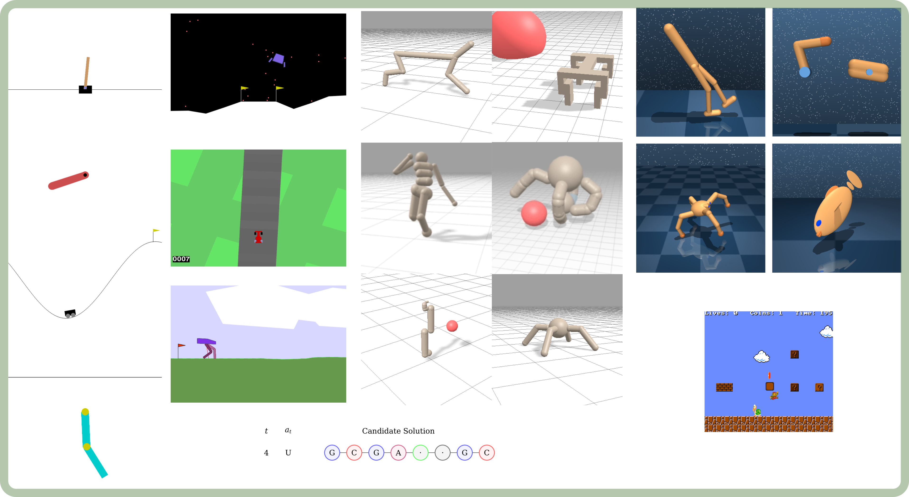
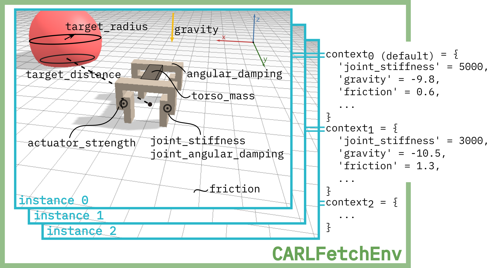

# The CARL Benchmark Library
CARL (context adaptive RL) provides highly configurable contextual extensions
to several well-known RL environments. 
It's designed to test your agent's generalization capabilities
in all scenarios where intra-task generalization is important.

Benchmarks include:
- [OpenAI gym classic control suite](https://gym.openai.com/envs/#classic_control) extended with several physics 
  context features like gravity or friction
    
- [OpenAI gym Box2D](https://gym.openai.com/envs/#box2d) BipedalWalker, LunarLander and
  CarRacing, each with their own modification possibilities like
  new vehicles to race
  
- All [Brax locomotion environments](https://github.com/google/brax) with exposed internal features
  like joint strength or torso mass
  
- [Super Mario (TOAD-GAN)](https://github.com/Mawiszus/TOAD-GAN), a procedurally generated jump'n'run game with control
  over level similarity
  
- [RNADesign](https://github.com/automl/learna/), an environment for RNA design given structure
  constraints with structures from different datasets to choose from


   

## Installation
We recommend you use a virtual environment (e.g. Anaconda) to 
install CARL and its dependencies.

First, clone our repository and install the basic requirements:
```bash
git clone https://github.com/automl/CARL.git --recursive
cd carl
pip install .
```
This will only install the basic classic control environments, which should run on most operating systems. For the full set of environments, use the install options:
```bash
pip install -e [box2d, brax, rna, mario]
```
These may not be compatible with Windows systems. Box2D environment may need to be installed via conda on MacOS systems:
```bash
conda install -c conda-forge gym-box2d
```
In general, we test on Linux systems, but aim to keep the benchmark compatible with MacOS as much as possible.

To install the additional requirements for ToadGAN:
```bash
javac src/envs/mario/Mario-AI-Framework/**/*.java
```

If you want to use the RNA design environment:
```bash
cd src/envs/rna/learna
make requirements
make data
```
In case you want to run our experiments or use our training files, also install the experiment dependencies:
```bash
pip install -e [experiments]
```
## Train an Agent
To get started with CARL, you can use our 'train.py' script.
It will train a PPO agent on the environment of your choice
with custom context variations that are sampled from a standard 
deviation. 

To use MetaCartPole with variations in gravity and friction by 20% 
compared to the default, run:
```bash
python train.py 
--env CARLCartPoleEnv 
--context_args gravity friction
--default_sample_std_percentage 0.2
--outdir <result_location>
```
You can use the plotting scripts in src/eval to view the results.

## CARL's Contextual Extension
CARL contextually extends the environment by making the context visible and configurable. During training we therefore can encounter different contexts and train for generalization. We exemplarily show how Brax' Fetch is extended and embedded by CARL. Different instiations can be achieved by setting the context features to different values. 



## Cite Us
```bibtex
@misc{CARL,
  author    = {C. Benjamins and 
               T. Eimer and 
               F. Schubert and 
               A. Biedenkapp and 
               B. Rosenhahn and 
               F. Hutter and 
               M. Lindauer},
  title     = {CARL: A Benchmark for Contextual and Adaptive Reinforcement Learning},
  howpublished = {https://github.com/automl/CARL},
  year      = {2021},
  month     = aug,
}
```

## References
[OpenAI gym, Brockman et al., 2016. arXiv preprint arXiv:1606.01540](https://arxiv.org/pdf/1606.01540.pdf)

[Brax -- A Differentiable Physics Engine for Large Scale 
Rigid Body Simulation, Freeman et al., NeurIPS 2021 (Dataset & 
Benchmarking Track)](https://arxiv.org/pdf/2106.13281.pdf)

[TOAD-GAN: Coherent Style Level Generation from a Single Example,
Awiszus et al., AIIDE 2020](https://arxiv.org/pdf/2008.01531.pdf)

[Learning to Design RNA, Runge et al., ICRL 2019](https://arxiv.org/pdf/1812.11951.pdf)
